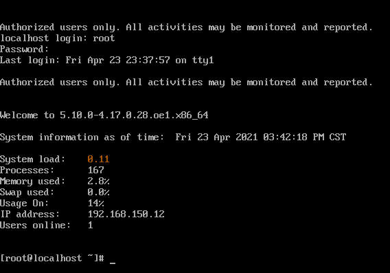

# CloudNative Sig Notes

## OpenEuler21.03安装记录
[TOC]
### 安装到VMware并配置静态IP
安装过程跟[安装openEuler 20.03 LTS SP1](../openEuler_notes.md)差不多，开机之后没有ip地址，查看<code>/etc/systemconfig/network-scripts/ens32</code>发现ONBOOOT参数是NO，且分配方式为DHCP。

同样，为了用ssh连接方便，改为静态IP【**与主机同一网段**】。并配置DNS。
```sh
TYPE=Ethernet
PROXY_METHOD=none
BROWSER_ONLY=no
BOOTPROTO=static
DEFROUTE=yes
IPADDR=192.168.150.12
NETMASK=255.255.255.0
PREFIX=24
GATEWAY=192.168.150.2
DNS1=8.8.8.8
DNS2=8.8.4.4
IPV4_FAILURE_FATAL=no
IPV6INIT=yes
IPV6_AUTOCONF=yes
IPV6_DEFROUTE=yes
IPV6_FAILURE_FATAL=no
IPV6_ADDR_GEN_MODE=stable-privacy
NAME=ens32
UUID=fee685fa-f396-448d-aa4c-f431b66de805
DEVICE=ens32
ONBOOT=yes
AUTOCONNECT_PRIORITY=-999

```

重启网络服务
```sh
systemctl restart NetworkManager
```
开机：



ping百度：


正常。

### 配置DNF
查看版本：
```sh
cat /etc/os-release
```

打开dnf配置文件
```sh
vi /etc/dnf/dnf.conf
```

```sh
[main]
gpgcheck=0
installonly_limit=3
clean_requirements_on_remove=True
best=True
skip_if_unavailable=False
```
修改如上配置，关闭gpgcheck=0 。

```sh
vi /etc/yum.repos.d/openEuler_x86_64.repo
```
将如下配置写入保存，用华为镜像加速站的地址：https://mirrors.huaweicloud.com/openeuler/openEuler-21.03/OS/x86_64/

```sh
[repository]
name=openEuler
baseurl=https://mirrors.huaweicloud.com/openeuler/openEuler-21.03/OS/x86_64/
```

