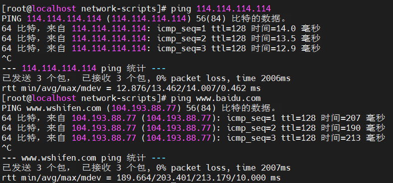
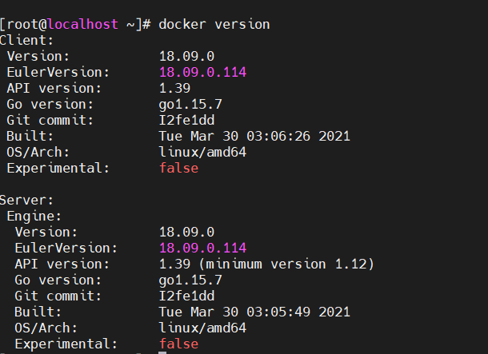
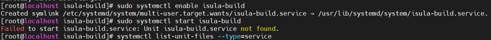
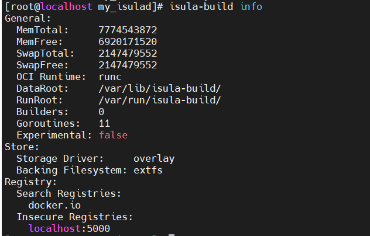
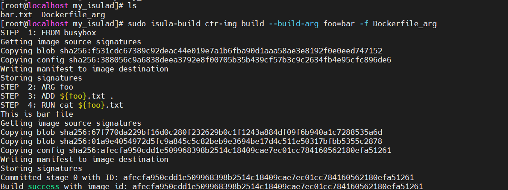
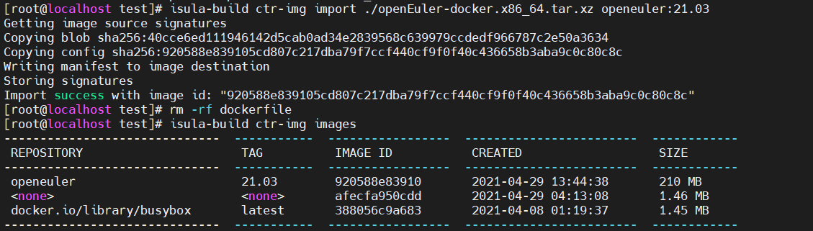

# CloudNative Sig Notes
[TOC]
## OpenEuler21.03安装记录
### 安装到VMware并配置静态IP
安装过程跟[安装openEuler 20.03 LTS SP1](../openEuler_notes.md)差不多，开机之后没有ip地址，查看<code>/etc/systemconfig/network-scripts/ens32</code>发现ONBOOOT参数是NO，且分配方式为DHCP。

同样，为了用ssh连接方便，改为静态IP【**与主机同一网段**】。并配置DNS。
```sh
TYPE=Ethernet
PROXY_METHOD=none
BROWSER_ONLY=no
BOOTPROTO=static
DEFROUTE=yes
IPADDR=192.168.150.12
NETMASK=255.255.255.0
PREFIX=24
GATEWAY=192.168.150.2
DNS1=8.8.8.8
DNS2=8.8.4.4
IPV4_FAILURE_FATAL=no
IPV6INIT=yes
IPV6_AUTOCONF=yes
IPV6_DEFROUTE=yes
IPV6_FAILURE_FATAL=no
IPV6_ADDR_GEN_MODE=stable-privacy
NAME=ens32
UUID=fee685fa-f396-448d-aa4c-f431b66de805
DEVICE=ens32
ONBOOT=yes
AUTOCONNECT_PRIORITY=-999

```

重启网络服务
```sh
systemctl restart NetworkManager
```
开机：


ping百度：



正常。

### 配置DNF
查看版本：
```sh
cat /etc/os-release
```

打开dnf配置文件
```sh
vi /etc/dnf/dnf.conf
```

```sh
[main]
gpgcheck=0
installonly_limit=3
clean_requirements_on_remove=True
best=True
skip_if_unavailable=False
```
修改如上配置，关闭gpgcheck=0 。

```sh
vi /etc/yum.repos.d/openEuler_x86_64.repo
```
将如下配置写入保存，用华为镜像加速站的地址：https://mirrors.huaweicloud.com/openeuler/openEuler-21.03/OS/x86_64/

```sh
[repository]
name=openEuler
baseurl=https://mirrors.huaweicloud.com/openeuler/openEuler-21.03/OS/x86_64/
```

## OpenEuler 21.03 安装docker
yum安装
更新yum源：
```sh
wget -O /etc/yum.repos.d/openEulerOS.repo https://repo.huaweicloud.com/repository/conf/openeuler_x86_64.repo
    yum clean all
    yum makecache
```
安装docker
```sh
yum intall -y docker
```
查看版本




## isula-build
> 是iSula容器团队推出的容器镜像构建工具，支持通过Dockerfile文件快速构建容器镜像。

根据[官方文档](https://gitee.com/openeuler/isula-build)，我使用yum方式安装，并以守护进程方式开启服务。
开启服务可能会出现Unit not found：



我的原因是重复安装导致<code> /etc/systemd/system/ </code>下出现重复的以isula-build为前缀的文件，全部卸载并删除相关文件，重新安装就好了。

在<code>/etc/isula-buid/</code>下配置registries.toml：镜像仓库相关配置，主要包括允许isula-build使用的镜像仓库列表和insecure仓库列表。
```sh
[registries.search]
registries = ['docker.io']
```
要快速开始使用isula-build，只需要给它配置**允许查找和拉取镜像的仓库地址**，并且保证**网络连通**，就可以完成配置，开启容器镜像构建之旅。
我的配置：



### 构建镜像
在/opt下，创建工作目录，编写Dockerfile：
```sh
mkdir my_isulad
cd  my_isulad
```
编写Dockerfile：
```sh
echo "This is bar file" > bar.txt
cat Dockerfile_arg
FROM busybox
ARG foo
ADD ${foo}.txt .
RUN cat ${foo}.txt
```
构建镜像：
```sh
sudo isula-build ctr-img build --build-arg foo=bar -f Dockerfile_arg
```



查看镜像：
```sh
sudo isula-build ctr-img images
```


### 导入镜像




