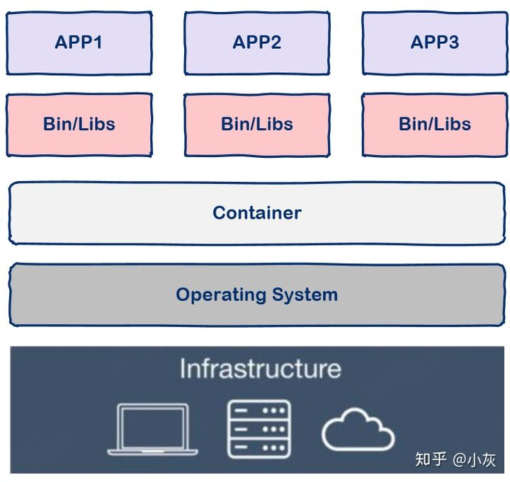
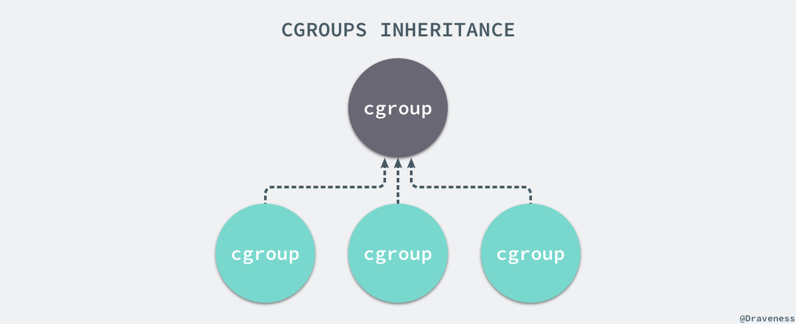
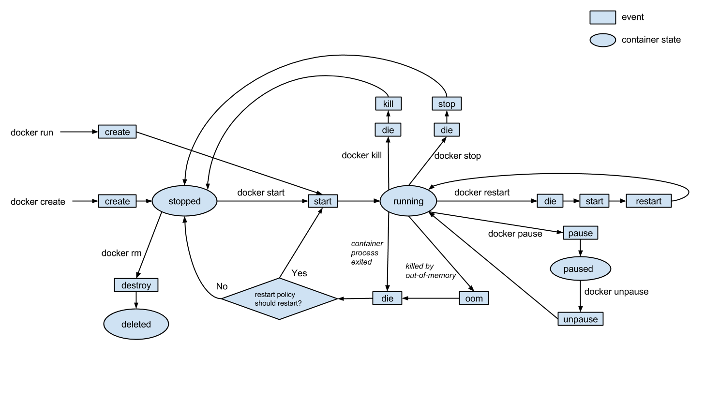
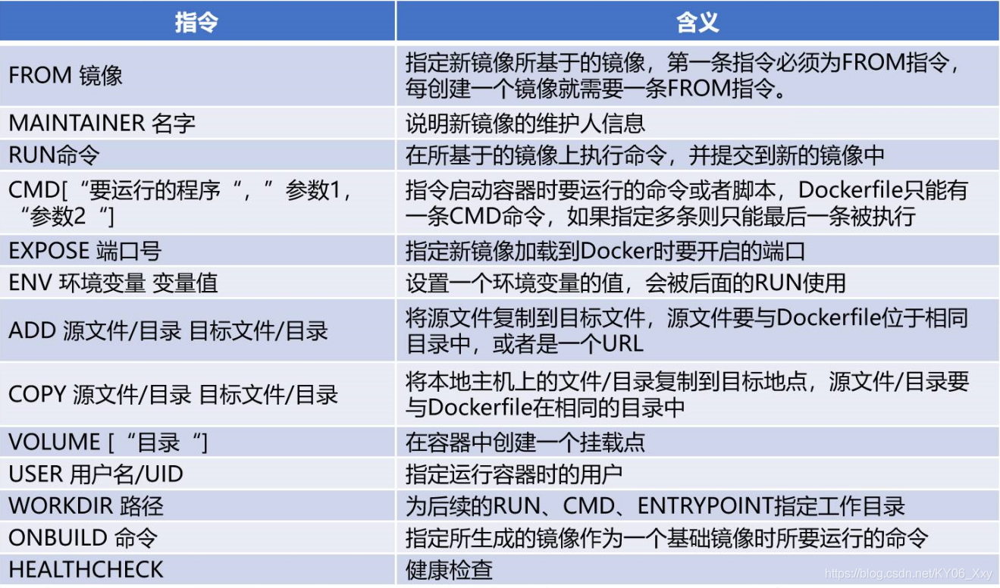

# Docker学习笔记
[TOC]
- [Docker学习笔记](#docker学习笔记)
  * [容器技术](#容器技术)
    + [起源](#起源)
    + [容器](#容器)
      - [容器和虚拟机](#容器和虚拟机)
  * [概念](#概念)
    + [定义](#定义)
    + [CentOS 7安装](#centos-7安装)
      - [安装hadoop2.8.5集群](#安装hadoop285集群)
    + [docker工作过程](#docker工作过程)
  * [底层原理](#底层原理)
      - [NameSpace](#namespace)
      - [Control groups](#control-groups)
  * [相关命令](#相关命令)
      - [Docker镜像](#docker镜像)
      - [Docker容器和虚拟机的区别](#docker容器和虚拟机的区别)
      - [容器的生命周期](#容器的生命周期)
      - [Docker的容器与镜像关系](#docker的容器与镜像关系)
      - [镜像构建方式](#镜像构建方式)
    + [Dockerfile](#dockerfile)
      - [结构](#结构)
      - [指令](#指令)


## 容器技术
### 起源
- 重复搭建环境（开发、测试、运维）
- 只用于部署应用虚拟机太大（操作系统），且启动很慢
### 容器
- 相互隔离
- 长期反复使用
- 快速装载卸载
- 规格标准
#### 容器和虚拟机
虚拟机通过**操作系统**实现隔离，容器通过**隔离应用程序的运行时环境**（依赖的库和配置），但共享一个操作系统。




容器轻量级且占用资源更少.多个虚拟机使用多个操作系统内核，而多个容器共享宿主机操作系统内核。


## 概念
### 定义
Docker 是一个开源的、轻量级的容器引擎，主要运行于 Linux 和 Windows，用于创建、管理和编排容器。
- 镜像Image
包含有文件系统的、面向Docker引擎的、只读模板
提供运行环境
- 容器Container
轻量级的沙盒，极简的Linux系统环境(root权限、进程空间、用户空间、网络空间...)，以及运行在其中的应用程序。
Docker引擎利用容器来运行、隔离各个应用。容器是镜像创建的**应用实例**，可以**创建、启动、停止、删除**容器，各个容器之间是是相互隔离的，互不影响。
> 注意：镜像本身是只读的，容器从镜像启动时，Docker在镜像的上层创建一个**可写层**，镜像本身不变。
- 仓库Repository
类似于代码仓库，这里是镜像仓库，是Docker用来**集中存放镜像文件**的地方。注意与注册服务器（Registry）的区别：注册服务器是存放仓库的地方，一般会有多个仓库；而仓库是存放镜像的地方，一般每个仓库存放一类镜像，每个镜像利用tag进行区分，比如Ubuntu仓库存放有多个版本（12.04、14.04等）的Ubuntu镜像。


### CentOS 7安装

安装docker
```sh
yum install -y docker
```

启动docker
```sh
systemctl start docker
systemctl enable docker
systemctl status docker
```


配置镜像加速
```sh
mkdir -p /etc/docker

tee /etc/docker/daemon.json <<-'EOF'
{
  "registry-mirrors": [
  			"https://mirror.ccs.tencentyun.com",
		  	"https://hub-mirror.c.163.com",
			"https://mirror.baidubce.com"
		]
}
EOF

systemctl daemon-reload
systemctl restart docker
```

#### 安装hadoop2.8.5集群
下载jdk和hadoop安装包到/opt/hadoop_docker/tools


一些用于创建镜像、启动和停止容器的脚本：


Dockerfile内容：

<pre lang="txt">
<code>

FROM centos:7
MAINTAINER WANGChuwei  chu@stu.pku.edu.cn

LABEL Discription="hadoop base of centos7" version="1.0"

#安装必备的软件包
RUN yum -y install net-tools
RUN yum -y install which
RUN yum -y install openssh-server openssh-clients
RUN yum clean all

#配置SSH免密登录
RUN ssh-keygen -q -t rsa -b 2048 -f /etc/ssh/ssh_host_rsa_key -N ''
RUN ssh-keygen -q -t ecdsa -f /etc/ssh/ssh_host_ecdsa_key -N ''
RUN ssh-keygen -q -t dsa -f /etc/ssh/ssh_host_ed25519_key  -N ''
RUN ssh-keygen -f /root/.ssh/id_rsa -N ''
RUN touch /root/.ssh/authorized_keys
RUN cat /root/.ssh/id_rsa.pub >> /root/.ssh/authorized_keys
RUN echo "root:mypassword" | chpasswd
COPY ./configs/ssh_config /etc/ssh/ssh_config

#添加JDK 增加JAVA_HOME环境变量
ADD ./tools/jdk-8u212-linux-x64.tar.gz /usr/local/
ENV JAVA_HOME /usr/local/jdk1.8.0_212/
ENV CLASSPATH $JAVA_HOME/lib/dt.jar:$JAVA_HOME/lib/tools.jar

#添加Hadoop并设置环境变量
ADD ./tools/hadoop-2.8.5.tar.gz /usr/local
ENV HADOOP_HOME /usr/local/hadoop-2.8.5

#将环境变量添加到系统变量中
ENV PATH $HADOOP_HOME/bin:$JAVA_HOME/bin:$PATH

#拷贝Hadoop相关的配置文件到镜像中
COPY ./configs/hadoop-env.sh $HADOOP_HOME/etc/hadoop/hadoop-env.sh
COPY ./configs/hdfs-site.xml $HADOOP_HOME/etc/hadoop/hdfs-site.xml
COPY ./configs/core-site.xml $HADOOP_HOME/etc/hadoop/core-site.xml
COPY ./configs/yarn-site.xml $HADOOP_HOME/etc/hadoop/yarn-site.xml
COPY ./configs/mapred-site.xml $HADOOP_HOME/etc/hadoop/mapred-site.xml
COPY ./configs/master $HADOOP_HOME/etc/hadoop/master
COPY ./configs/slaves $HADOOP_HOME/etc/hadoop/slaves
COPY ./script/start-hadoop.sh $HADOOP_HOME/start-hadoop.sh
COPY ./script/restart-hadoop.sh $HADOOP_HOME/restart-hadoop.sh

#增加执行权限
RUN chmod 700 $HADOOP_HOME/start-hadoop.sh
RUN chmod 700 $HADOOP_HOME/restart-hadoop.sh

#创建数据目录
RUN mkdir -p /data/hadoop/dfs/data && \
    mkdir -p /data/hadoop/dfs/name && \
    mkdir -p /data/hadoop/tmp

#开启SSH 22 端口
EXPOSE 22

#启动容器时执行的脚本文件
CMD ["/usr/sbin/sshd","-D"]

</code>
</pre>

构建镜像：
```sh
# ./build_docker_image.sh
#!/bin/bash
echo build centos-hadoop images
docker build -t="centos-hadoop" .
```
构建成功：


创建Docker网络：
```sh
#create_network.sh

#!/bin/bash

echo create network
docker network create --subnet=172.18.0.0/16 hadoop
echo create success
docker network ls
```


启动容器
```sh
#./start_container.sh
#!/bin/bash

echo start containers

echo start hadoop-node1 container ...
docker run -itd --restart=always --net hadoop --ip 172.18.0.2 --privileged -p 18032:8032 -p 28080:18080 -p 29888:19888 -p 17077:7077 -p 51070:50070 -p 18888:8888 -p 19000:9000 -p 11100:11000 -p 51030:50030 -p 18050:8050 -p 18081:8081 -p 18900:8900 --name hadoop-node1 --hostname hadoop-node1  --add-host hadoop-node2:172.18.0.3 --add-host hadoop-node3:172.18.0.4 centos-hadoop /bin/bash
echo "start hadoop-node2 container..."
docker run -itd --restart=always --net hadoop  --ip 172.18.0.3 --privileged -p 18042:8042 -p 51010:50010 -p 51020:50020 --name hadoop-node2 --hostname hadoop-node2 --add-host hadoop-node1:172.18.0.2 --add-host hadoop-node3:172.18.0.4 centos-hadoop  /bin/bash
echo "start hadoop-node3 container..."
docker run -itd --restart=always --net hadoop  --ip 172.18.0.4 --privileged -p 18043:8042 -p 51011:50011 -p 51021:50021 --name hadoop-node3 --hostname hadoop-node3 --add-host hadoop-node1:172.18.0.2 --add-host hadoop-node2:172.18.0.3  centos-hadoop /bin/bash

sleep 5
docker exec -it hadoop-node1 /usr/sbin/sshd
docker exec -it hadoop-node2 /usr/sbin/sshd
docker exec -it hadoop-node3 /usr/sbin/sshd
sleep 5
docker exec -it hadoop-node1 /usr/local/hadoop-2.8.5/start-hadoop.sh

echo finished
docker ps

```

这里出错了。。。没有解决


尝试的办法有：修改hosts文件、检查ssh服务
进入容器发现没有ssh。。yum出错：


尝试修改yum源--失败、配置DNS--失败


### docker工作过程
> 可以简单的把image理解为可执行程序，container就是运行起来的进程。
那么写程序需要源代码，那么“写”image就需要dockerfile，dockerfile就是image的源代码，docker就是"编译器"。
因此我们只需要在dockerfile中指定需要哪些程序、依赖什么样的配置，之后把dockerfile交给“编译器”docker进行“编译”，也就是**docker build**命令，生成的可执行程序就是**image**，之后就可以运行这个image了，这就是**docker run**命令，image运行起来后就是docker **container**。

- docker基于C/S架构，client处理用户输入命令，真正工作的是docker server(daemon)

1. **build** 
docker daemon根据dockerfile创建出image


2. **run** 
docker daemon加载image到内存，执行image，即container


3. **pull**  
docker daemon从registry下载写好的image到本地


## 底层原理


#### NameSpace
Linux中的PID、IPC、网络等资源是**全局**的，而NameSpace机制是一种**资源隔离方案**，在该机制下这些资源就不再是全局的了，而是属于某个特定的NameSpace，各个NameSpace下的资源互不干扰，这就使得每个NameSpace看上去就像一个独立的操作系统一样。

在linux下使用ps命令打印操作系统正在执行的进程，会有很多，比较特殊的是pid为1的init进程和pid为2的kthreadd进程，都由idle上帝进程创建出来。


- init
负责执行内核的一部分初始化工作和系统配置，也会创建一些类似 getty 的注册进程
- kthreaddd
负责管理和调度其他的内核进程。


如果运行一个docker容器，再使用ps命令，并exec进入内部的bash，打印全部进程，则只有少数进程。
```sh
docker run -it -d centos
```


```sh
docker exec -it a6fa2404052f /bin/bash
```


 

**Docker 通过命名空间成功完成了与宿主机进程和网络的隔离。**
 
> [docker run 命令的 -i -t -d选项的作用](https://blog.csdn.net/claram/article/details/104228727)

#### Control groups

**Chroot**
在 Linux 系统中，系统默认的目录就都是以 / 也就是根目录开头的，chroot 的使用能够改变当前的系统根目录结构，通过改变当前系统的根目录，我们能够限制用户的权利，**在新的根目录下并不能够访问旧系统根目录的结构个文件**，也就建立了一个与原系统完全隔离的目录结构。

虽然有了NameSpace技术可以实现资源隔离，但**进程**还是可以不受控的访问**系统资源**（物理资源），比如CPU、内存、磁盘、网络等。如果其中的某一个容器正在执行 CPU 密集型的任务，那么就会影响其他容器中任务的性能与执行效率，导致多个容器**相互影响并且抢占资源**。


为了控制容器中进程对资源的访问，Docker采用**control groups**技术(也就是cgroup)，有了cgroup就可以控制容器中进程对系统资源的消耗了，比如限制某个容器使用内存的上限、可以在哪些CPU上运行等等。


每一个 CGroup 都是一组被相同的标准和参数限制的进程，不同的 CGroup 之间是有层级关系的，也就是说它们之间可以从父类继承一些用于限制资源使用的标准和参数。



Linux 的 CGroup 能够为一组进程分配资源，也就是我们在上面提到的 CPU、内存、网络带宽等资源，通过对资源的分配，CGroup 能够提供以下的几种功能：


> 在 CGroup 中，所有的任务就是一个系统的一个进程，而 CGroup 就是一组按照某种标准划分的进程，在 CGroup 这种机制中，所有的资源控制都是以 CGroup 作为单位实现的，每一个进程都可以随时加入一个 CGroup 也可以随时退出一个 CGroup。

## 相关命令
#### Docker镜像
镜像是一个Docker的可执行文件，其中包括运行应用程序所需的所有代码内容、依赖库、环境变量和配置文件等。
**镜像管理**


#### Docker容器和虚拟机的区别
- 相同点
  - 容器和虚拟机一样，都会对**物理硬件资源**进行共享使用。
  - 容器和虚拟机的**生命周期**比较相似（**创建、运行、暂停、关闭**等等）。
  - 容器中或虚拟机中都可以安装各种应用，如redis、mysql、nginx等。也就是说，在容器中的操作，如同在一个虚拟机(操作系统)中操作一样。
  - 同虚拟机一样，容器创建后，会存储在宿主机上：linux上位于/var/lib/docker/containers下
- 不同点
  - 虚拟机的创建、启动和关闭都是基于一个完整的操作系统。一个虚拟机就是一个完整的操作系统。而容器**直接运行在宿主机的内核**上，其本质上以一系列**进程的结合**。
  - 容器是轻量级的，虚拟机是重量级的。首先容器**不需要额外的资源**来管理(不需要Hypervisor、Guest OS)，虚拟机额外更多的性能消耗；其次创建、启动或关闭容器，如同创建、启动或者关闭**进程**那么轻松，而创建、启动、关闭一个操作系统就没那么方便了。
也因此，意味着在给定的硬件上能运行更多数量的容器，甚至可以直接把Docker运行在虚拟机上。

#### 容器的生命周期




[Docker生命周期相关命令](https://blog.csdn.net/wzf862187413/article/details/87803812)


#### Docker的容器与镜像关系
配置好容器后可以将其转化为镜像存储到仓库。


[Docker网络配置](http://blog.itpub.net/31556785/viewspace-2565390/)

#### 镜像构建方式


- 从**容器**构建镜像（以下简称容器镜像）
  - 创建一个容器，比如使用 tomcat:latest 镜像创建一个tomcat-test容器
  - 修改tomcat-test容器的文件系统，比如修改tomcat的server.xml文件中的默认端口
  - 使用**commit**命令提交镜像
- 使用**Dockerfile**构建镜像（以下简称Dockerfile镜像）
  - 编写Dockerfile文件
  - 使用**build**命令构建镜像


**两种构建方式的区别**
1. **容器镜像**的构建者可以任意修改容器的文件系统后进行发布，这种修改对于镜像使用者来说是*不透明的*，镜像构建者一般也不会将对容器文件系统的每一步修改，记录进文档中，供镜像使用者参考。
 **容器镜像**不能（更准确地说是不建议）通过修改，生成新的容器镜像。
2. 从镜像运行容器，实际上是在镜像顶部上加了一层可写层，所有对容器文件系统的修改，都在这一层中进行，不影响已经存在的层。比如在容器中删除一个1G的文件，从用户的角度看，容器中该文件已经没有了，但从文件系统的角度看，文件其实还在，只不过在顶层中标记该文件已被删除，当然这个标记为已删除的文件还会占用镜像空间。从容器构建镜像，实际上是把容器的顶层固化到镜像中。
也就是说， 对**容器镜像**进行修改后，生成新的容器镜像，*会多一层，而且镜像的体积只会增大*，不会减小。长此以往，镜像将变得越来越臃肿。Docker提供的 export 和 import 命令可以一定程度上处理该问题，但也并不是没有缺点。
3. **容器镜像**依赖的父镜像变化时，容器镜像必须进行*重新构建*。如果没有编写自动化构建脚本，而是手工构建的，那么又要重新修改容器的文件系统，再进行构建，这些重复劳动其实是没有价值的。
4. **Dockerfile**镜像是*完全透明*的，所有用于构建镜像的指令都可以通过Dockerfile看到。甚至你还可以递归找到本镜像的任何父镜像的构建指令。也就是说，你可以完全了解一个镜像是如何从零开始，通过一条条指令构建出来的。
5. **Dockerfile**镜像需要修改时，可以通过*修改Dockerfile中的指令*，再重新构建生成，没有任何问题。
6. **Dockerfile**可以在GitHub等源码管理网站上进行托管，DockerHub自动关联源码进行构建。当你的 Dockerfile变动，或者依赖的父镜像变动，都会触发镜像的自动构建，非常方便。


### Dockerfile
Docker 可以通过 Dockerfile 的内容来自动构建镜像。
Dockerfile 是一个包含创建镜像所有命令的文本文件，通过docker build命令可以根据Dockerfile 的内容构建镜像。


- Dockerfile中的每个指令都会创建一个新的镜像层
- 镜像层将被缓存和复用
- 当Dockerfile的指令修改了，复制的文件变化了，或者构建镜像时指定的变量不同了，对应的镜像层缓存就会失效
- 某一层的镜像缓存失效之后，它之后的镜像层都会失效
- 镜像层时不可变的，如果在某一层中添加一个文件，然后再下一层中删除它，则镜像中依然会包含该文件

#### 结构
- 基础镜像信息
- 维护者信息
- 镜像操作指令
- 容器启动时执行指令
#### 指令

Dockerfile 有以下指令选项:



示例：
<pre ><code >
#基于centos:7的基础镜像
FROM centos:7
#维护镜像的用户信息
MAINTAINER this is project
#镜像操作指令安装apache软件
RUN yum -y update
RUN yum -y install httpd
#开启80端口
EXPOSE 80
#复制网址首页文件
ADD index.html /var/www/html/index.html
#将执行脚本复制到镜像中
ADD run.sh /run.sh
RUN chmod 755 /run.sh
#启动容器时执行脚本
CMD ["/run.sh"]
</code>
</pre>


