# OpenEuler && LFS学习笔记
[TOC]
- [OpenEuler && LFS学习笔记](#openeuler----lfs----)
  * [环境](#环境)
  * [安装OpenEuler](#安装openeuler)
    + [配置静态IP](#配置静态ip)
      - [使用nmcli命令](#使用nmcli命令)
      - [使用ip命令](#使用ip命令-)
      - [通过ifcfg文件配置网络](#通过ifcfg文件配置网络)
  * [宿主机环境准备](#宿主机环境准备)
    + [宿主系统需求](#宿主系统需求)
    + [磁盘分区](#磁盘分区)
      - [创建新分区](#创建新分区)
      - [创建文件系统](#创建文件系统)
    + [软件包和补丁](#软件包和补丁)
    + [最后的准备工作](#最后的准备工作)
  * [构建LFS交叉⼯具链和临时⼯具](#构建lfs交叉⼯具链和临时⼯具)


## 环境
| 设备|版本 |
|:-:|:-:|
|主机操作系统|Win 10,64 bit|
|主机内存|8GB|
|虚拟机|VMware® Workstation 14 Pro|
|虚拟机操作系统|openEuler 20.03 LTS SP1|
|终端|MobaXterm v20.4|
## 安装OpenEuler
按照教程一步步来：[openEuler操作系统安装在vmware上](https://www.pianshen.com/article/15981091184/)
用MobaXterm连接的时候需要配置ip地址，用<code>ip addr</code>命令查看：

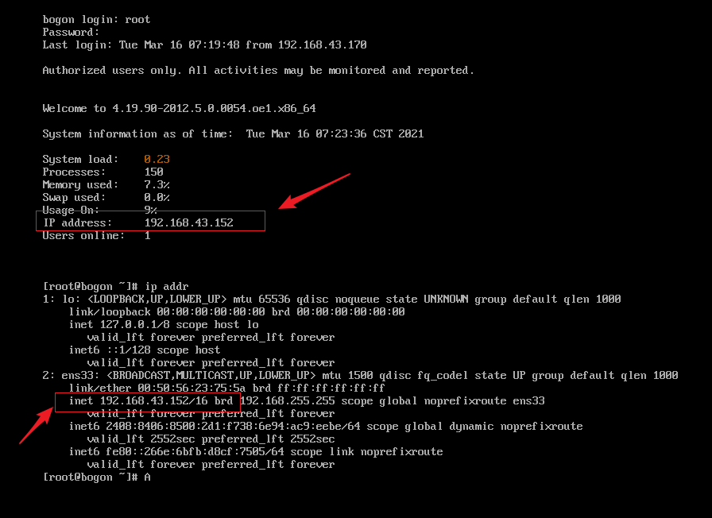

回到宿舍之后再启动虚拟机发现ip地址变了：

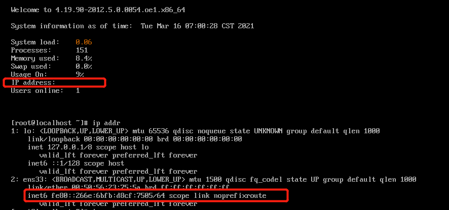

说明现在ip地址是动态的，为了用ssh工具连接方便，需要改成**静态IP**。
### 配置静态IP
根据官方文档[配置网络](https://openeuler.org/zh/docs/20.03_LTS_SP1/docs/Administration/%E9%85%8D%E7%BD%AE%E7%BD%91%E7%BB%9C.html)，有三种方式：

- **使用nmcli命令**
**立即生效**且系统重启后配置也**不会丢失**。
- **使用ip命令**
立即生效但系统**重启后配置会丢失**。
- **通过ifcfg文件配置网络**
**不会立即生效**，需要在root权限下执行systemctl reload NetworkManager命令以重启网络服务后才生效。

> 注意：自己配的IP要跟主机在一个网段，否则虚拟机无法上网。。。


#### 使用nmcli命令
**立即生效**且系统重启后配置也**不会丢失**。
以下命令添加一个静态的IPv4网络连接：
```shell
nmcli connection add type ethernet con-name connection-name
 ifname interface-name ip4 address gw4 address
```
比如我要添加一个连接名为net-static的地址为192.168.0.254的连接：
```shell
nmcli con add type ethernet con-name net-static
 ifname enp3s0 ip4 192.168.0.10/24 gw4 192.168.0.254
```
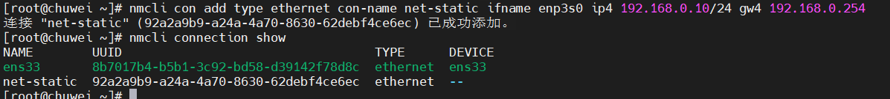

第二行是新添加的net-static连接，还要使用<code>nmcli con up net-static ifname enp3s0</code>命令来激活新的连接。
查看连接详情：
```shell
nmcli -p con show net-static
```

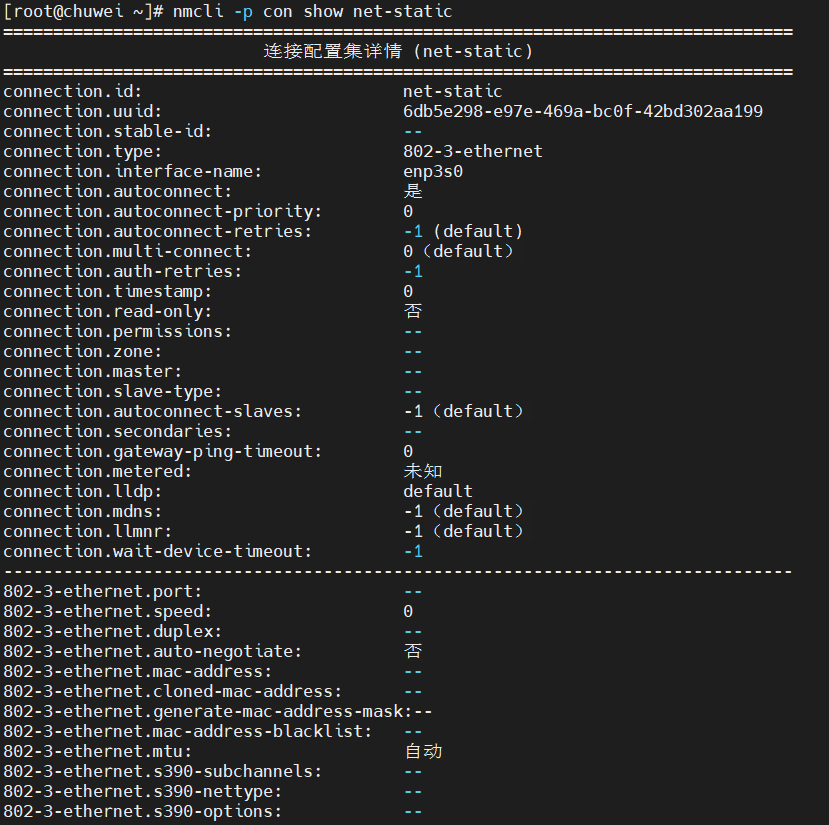

删除一个连接使用<code>nmcli con delete [con-name]</code>


#### 使用ip命令
立即生效但系统**重启后配置会丢失**。
示例：
```c
# ip address add 192.168.0.10/24 dev enp3s0
```

#### 通过ifcfg文件配置网络
**不会立即生效**，需要在root权限下执行systemctl reload NetworkManager命令以重启网络服务后才生效。
1. 修改<code>/etc/sysconfig/network-scripts/ifcfg-ens33</code>:

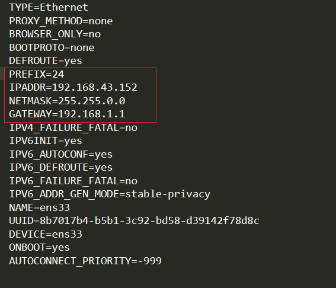

2. 重启

同时我发现在使用nmcli命令配置IP后，在<code>/etc/sysconfig/network-scripts/</code>目录下出现了一个名为<code>ifcfg-net-static</code>的文件：

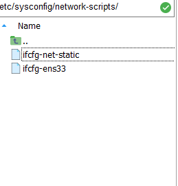

查看内容：

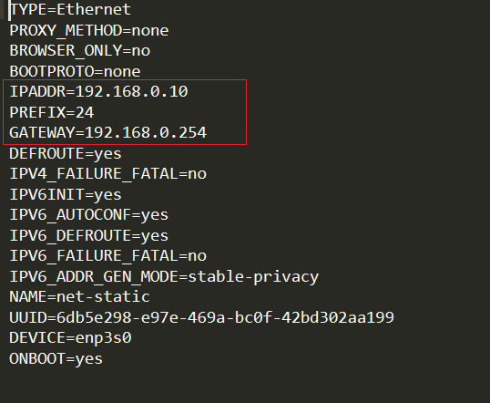

是和我们手动修改ifcfg文件添加的内容一样的，所以我猜想这两种方式本质上都是修改配置文件从而达到配置网络的目的。。。

## 宿主机环境准备
### 宿主系统需求
按照手册装完系统之后yum出错，很多包yum找不到对应软件包。
重新配yum源，修改yum源为华为云：
```sh
wget -O /etc/yum.repos.d/openEulerOS.repo https://repo.huaweicloud.com/repository/conf/openeuler_x86_64.repo

yum clean  all

yum makecache
```

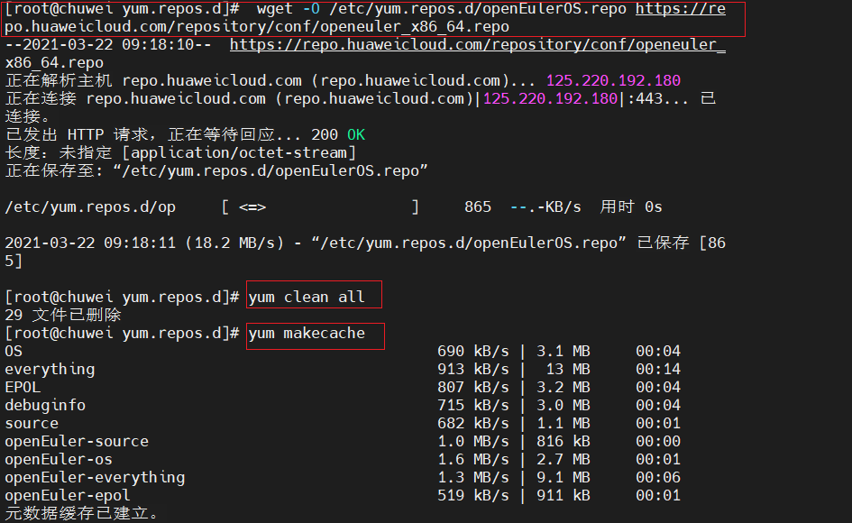


再次check：

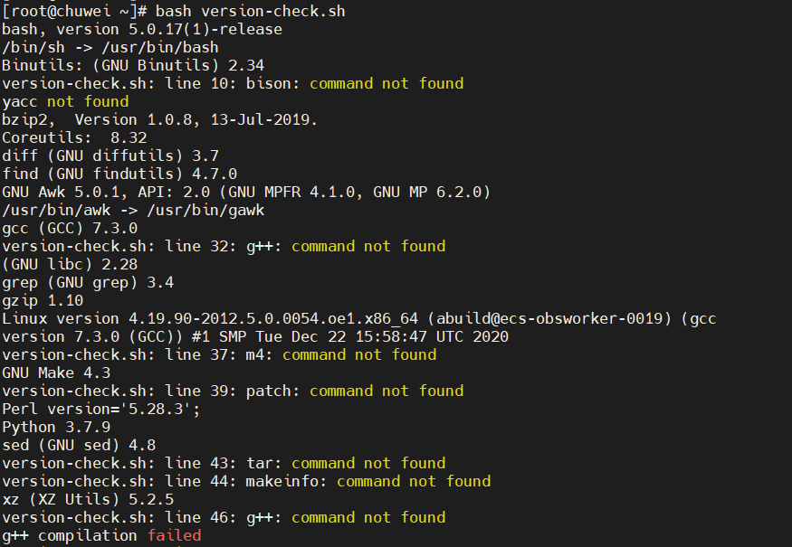

根据提示安装对应版本的软件包。

1. g++
```sh
   yum search "gcc-c++"
```

   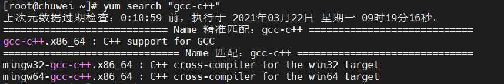

```sh
   yum install "gcc-c++.x86_64"
```
2. patch
```sh
   yum install patch
```
3. m4
```sh
   yum install m4
```
4. tar
```sh
   yum install tar
```
5. makeinfo
```sh
   yum install texinfo	
```
6. bision

由于yum找不到bision，手动wget安装bision到/usr/bin（[仓库](http://mirrors.ustc.edu.cn/gnu/bison/)）， 根据要求[下载2.7版本](https://blog.csdn.net/wch0lalala/article/details/105370314)

执行<code>sudo ./configure</code>出现“找不到命令”，<code>chmod +x  ./configure</code>增加可执行权限。

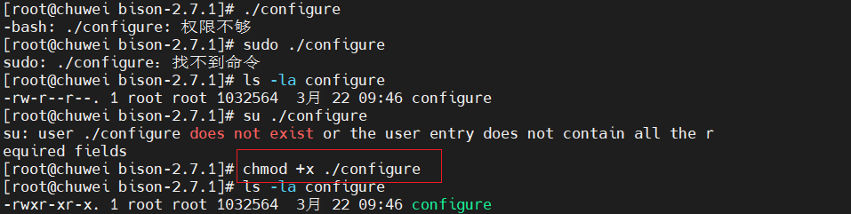

make出错，根据提示信息安装缺的包：

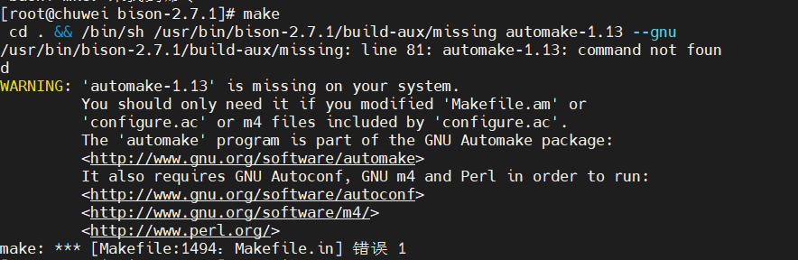

```sh
yum install automake
```
又出现permission denied，chmod

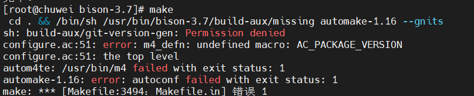


**在make过程中缺包就yum install，权限不够就chmod .**


装好需要的包之后，再次运行version-check。

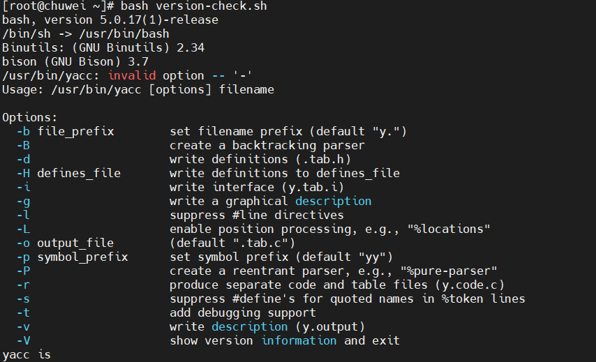


这应该是由于我之前执行了yum install byacc。直接yacc --version 发现它就是指向bision的:

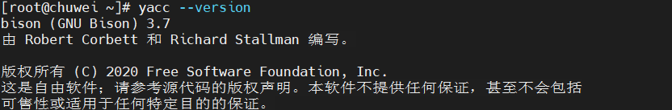


<code>whereis yacc</code>，并根据手册的命令行单独分别执行:
```sh
/usr/bin/yacc --version | head -n1  
/usr/local/bin/yacc --version | head -n1
```

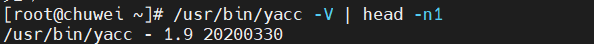


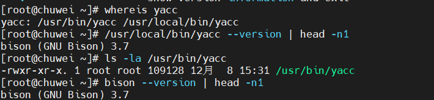


发现yacc存在两个地方，在/usr/local/bin/yacc是指向bision的我们需要的yacc。

把之前装的byacc卸载
```sh
yum remove byacc
```
再次check :


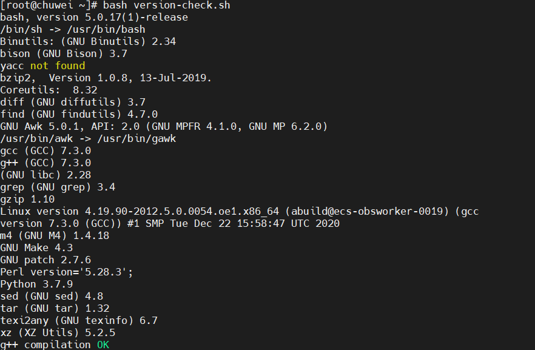


出现yacc command not found.按理说安装好bision之后yacc会自动安装，这里的yacc应该只剩/usr/loacl/bin下的了。

根据手册上：

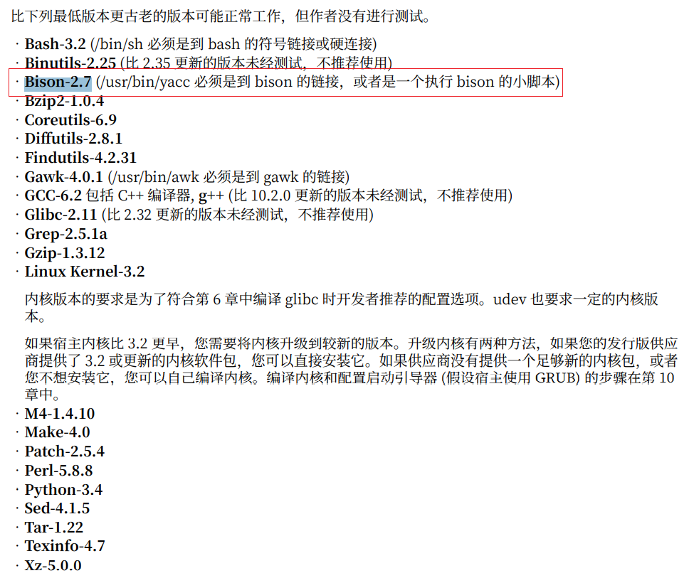


直接把yacc复制到/usr/bin下：

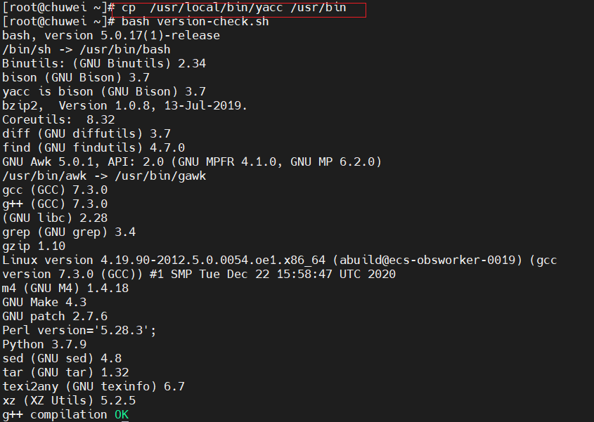


终于ok。

### 磁盘分区
#### 创建新分区
最小10GB系统区，2GB交换区。
虚拟机->设置->添加->硬盘->SCSI类型->创建新的虚拟磁盘

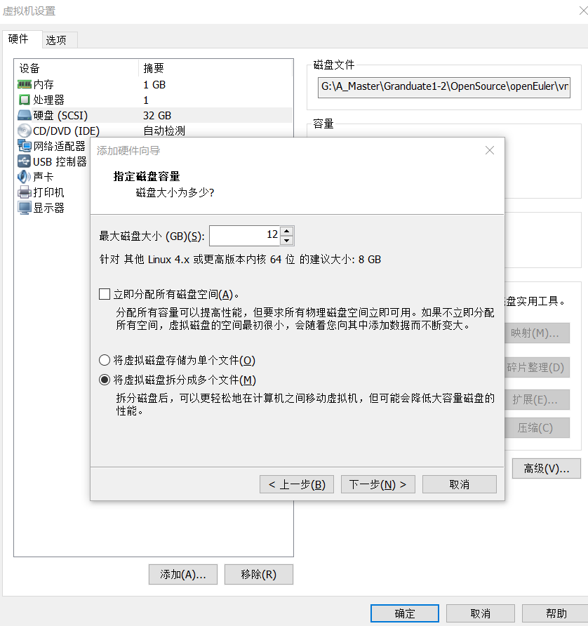

reboot
查看分区情况lsblk

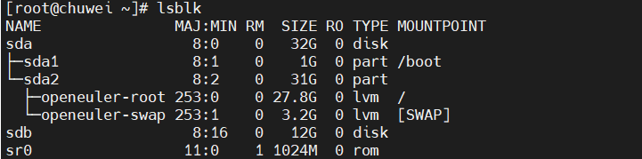

发现新的磁盘命名为sdb.
接下来进行分区，cfdisk，并选择gpt标签。
```sh
cfdisk /dev/sdb
```

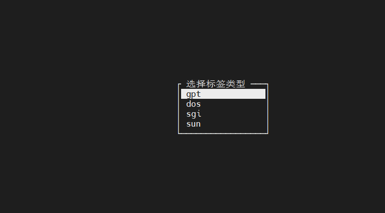

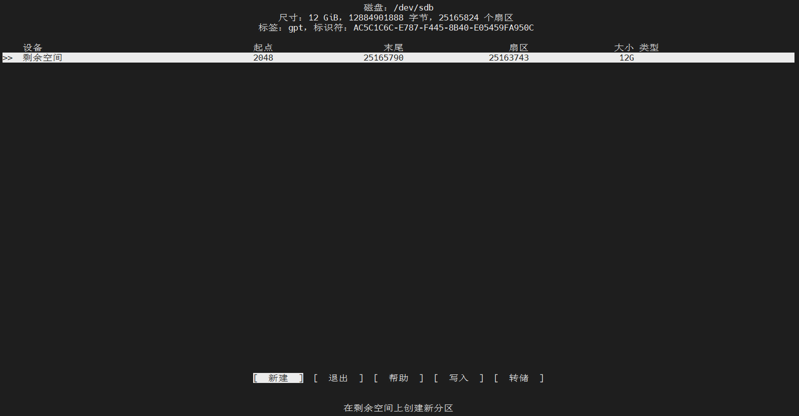


这里依次：新建->10GB->类型->Linux文件系统->写入；新建->2GB->类型->Linux swap->写入；

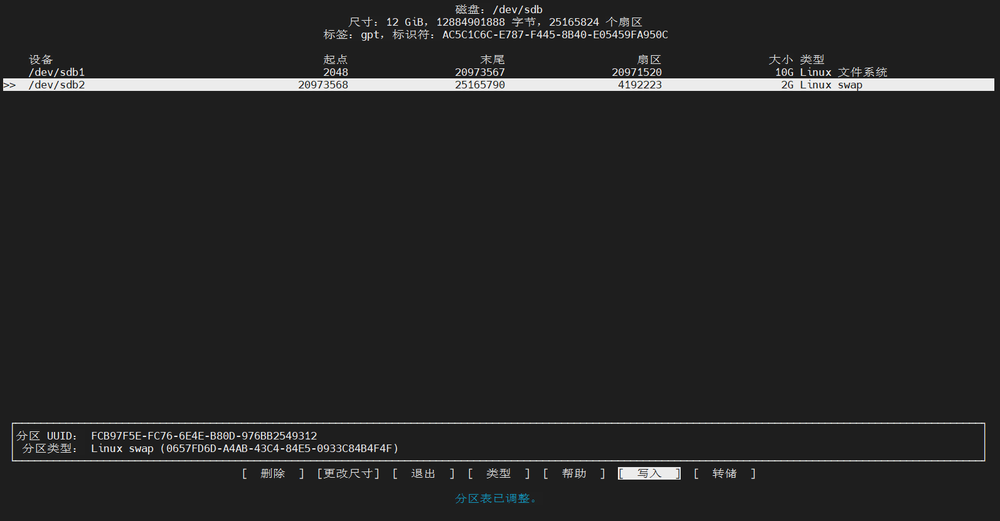

关于可选择的类型：

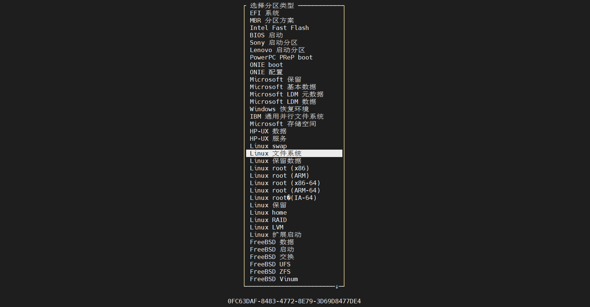

再次lsblk:

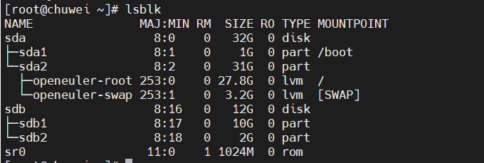

#### 创建文件系统
为sdb1创建ext4文件系统，并格式化sdb2为交换分区：
```sh
mkfs -v -t ext4 /dev/sdb1
mkswap /dev/sdb2
```

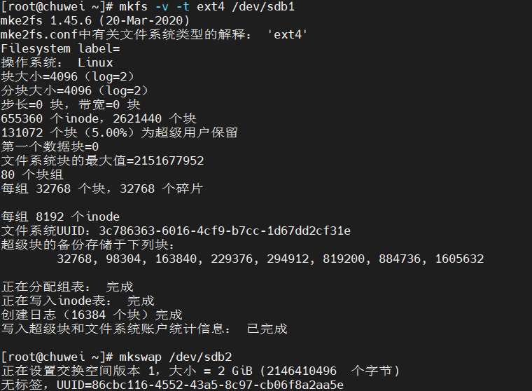

```sh
export LFS=/mnt/lfs
mkdir -pv $LFS
mount -v -t ext4 /dev/sdb1 $LFS
```
为了不用每次重启都重新挂载，修改 /etc/fstab，添加/dev/sdb1 /mnt/lfs ext4 defaults 1 1

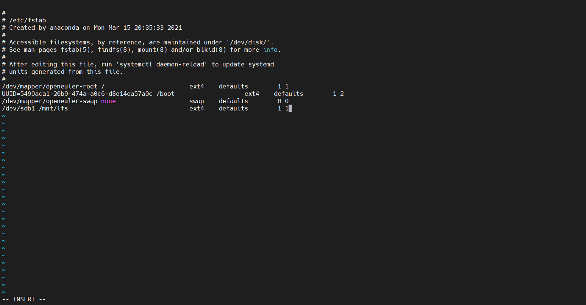

启用swap
```sh
/sbin/swapon -v /dev/sdb2
```

### 软件包和补丁
创建目录并更改权限
```sh
mkdir -v $LFS/sources
chmod -v a+wt $LFS/sources
```

1. 从手册上的网址获取wget-list:
```sh
wget http://www.linuxfromscratch.org/lfs/downloads/stable/wget-list
```
获取软件包：
```
wget --input-file=wget-list --continue --directory-prefix=$LFS/sources
```

校验源码包的方法:
进入到下载源码的目录，在终端输入如下的命令：
```sh
md5sum -c md5sums
```
其中，第二个md5sums是通过如上地址下载到的。

2. 选择镜像站并下载软件包，用时34m59s
```sh
wget http://mirrors.ustc.edu.cn/lfs/lfs-packages/10.0/wget-list
wget --input-file=wget-list --continue --directory-prefix=$LFS/sources
wget http://mirrors.ustc.edu.cn/lfs/lfs-packages/10.0/check.sh
```
检查软件包
```sh
bash check.sh
```
> 用MD5校验和会出很多错，忽略掉。check没问题就好了

### 最后的准备工作
创建目录布局
```sh
mkdir -pv $LFS/{bin,etc,lib,sbin,usr,var}
case $(uname -m) in
 x86_64) mkdir -pv $LFS/lib64 ;;
esac
```
将交叉编译器和其他程序分离
```sh
mkdir -pv $LFS/tools
```
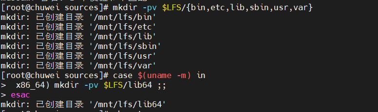

添加LFS用户
```sh
groupadd lfs
useradd -s /bin/bash -g lfs -m -k /dev/null lfs
```
将 lfs 设为 $LFS 中所有⽬录的所有者，使 lfs 对它们拥有完全访问权：
```sh
chown -v lfs $LFS/{usr,lib,var,etc,bin,sbin,tools}
case $(uname -m) in
 x86_64) chown -v lfs $LFS/lib64 ;;
esac
```
改变目录所有者
```sh
chown -v lfs $LFS/sources
```
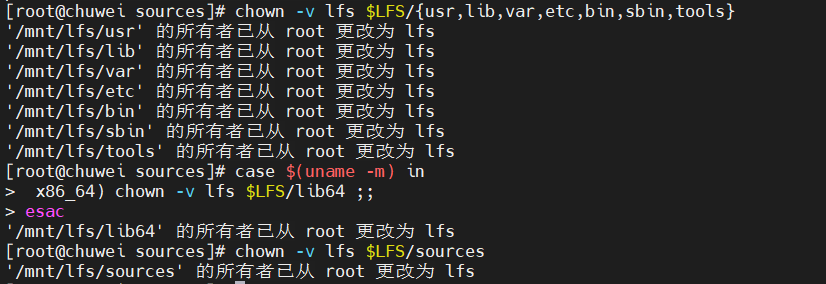


切换用户
```sh
su - lfs
```
配置环境；
新建⼀个除了 HOME, TERM 以及 PS1 外没有任何环境变量的 shell

```sh
cat > ~/.bash_profile << "EOF"
exec env -i HOME=$HOME TERM=$TERM PS1='\u:\w\$ ' /bin/bash
EOF
```
新的shell会读取并执行.bashrc：
```sh
cat > ~/.bashrc << "EOF"
set +h
umask 022
LFS=/mnt/lfs
LC_ALL=POSIX
LFS_TGT=$(uname -m)-lfs-linux-gnu
PATH=/usr/bin
if [ ! -L /bin ]; then PATH=/bin:$PATH; fi
PATH=$LFS/tools/bin:$PATH
export LFS LC_ALL LFS_TGT PATH
EOF
```
读取配置文件:
```sh
source ~/.bash_profile
```


## 构建LFS交叉⼯具链和临时⼯具
cc