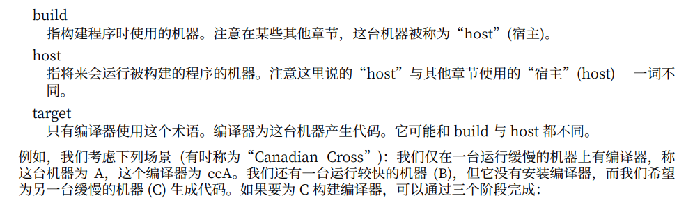
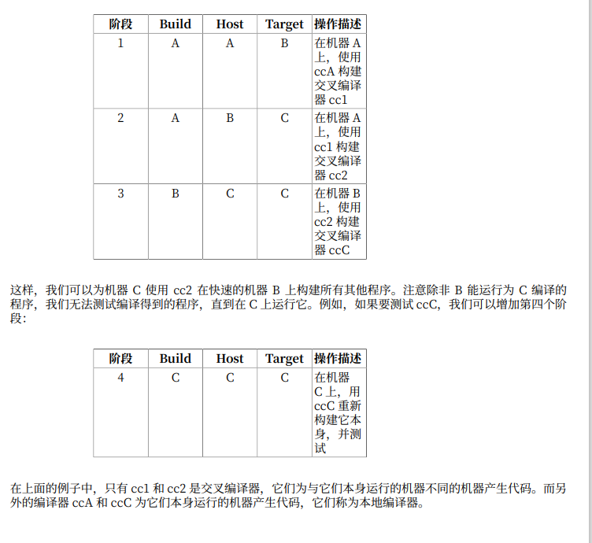
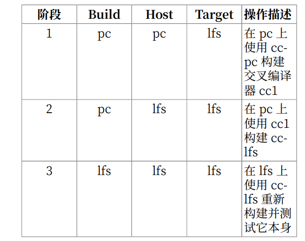
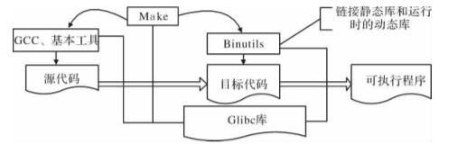
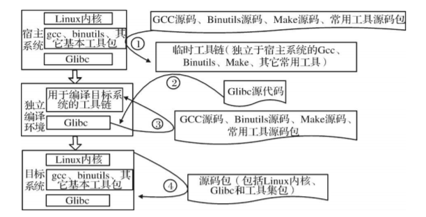
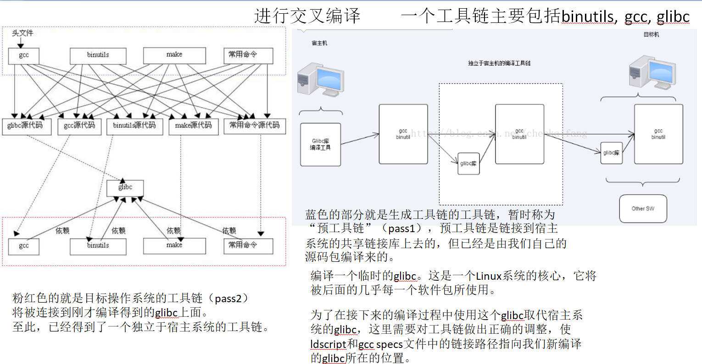

# LFS学习总结
## LFS目的
- Linux内核相当于车的发动机，发动机（内核）+轮子和方向盘（shell）+车架子和座椅（桌面）+倒车雷达/自动泊车（基础软件）= 汽车（Linux发行版）。
- LFS的目的是从零开始编译一个Linux操作系统，主要是从宿主系统编译出**独立的、纯净的**Linux操作系统。
  - 宿主系统要有健全的工具链、含有基本LFS所需要的源代码包、补丁和磁盘程序。
  - 要构建出独立纯净的环境，需要干净的、不依赖宿主系统的、能够自给自足的工具链，使用这个干净的工具链代替宿主系统中的工具链来编译剩余的系统。即需要**交叉编译**（在一个平台上编译另一个平台的代码）。
关于交叉编译，手册也给了详细的阐述：

对于LFS：

##  源代码包变为可执行文件
将源代码包变为可执行文件的过程大致要经过配置环境参数、make、make install等步骤：

- GCC是一个包含C/C++编译器的GNU编译器，结合其他基本工具可对源代码程序包进行编译而生成目标文件。
- Binutils是一组二进制工具集，包括连接器、汇编器和其他用于目标文件的工具，它可将目标文件转化成可执行文件。
- Make是一个类似于Shell脚本的程序，通过读入一个包含了源码及文件库的依赖关系和规划的makefile文件而控制整个编译链接过程。
这些工具依赖于C运行库Glibc，在已有的操作系统中。
Linux源码也需经过如上过程变成目标系统，但GCC Binutils、Make与其他基本工具（工具链）和Glibc是不能直接用在宿主系统中的。因为版本和环境是特定的，与宿主环境不一致。因此必须先构建出特定的工具链和Glibc，并把所有工具移植到目标系统中，使其有独立的编译能力，并在编译完成后卸载掉工具链。

1. 在现有宿主系统对工具集的源码进行编译得到**临时工具链**
2. 利用临时工具链对Glibc源码进行编译得到**独立的Glibc库**
3. 利用独立的Glibc库在宿主系统环境下搭建独立工具链，**独立编译环境**构建完成
4. 在独立编译环境下对Linux源码包进行编译，并将**Linux内核**构建至操作系统中
5. **收尾**：移除源码包、临时工具链、独立编译环境。并还原原有系统的各种参数和配置文件

## 主要步骤

主要步骤是：
1. 为新作系统分配磁盘分区并激活，创建一个环境变量几乎为空的编译用户lfs
2. 在lfs用户下首先编译出编译程序必须使用的工具：Binutils、GCC、Linux API、Headers、Glibc（此时的汇编器和链接程序还都依赖于宿主系统的环境）
3. 通过调整工具链来切断Binutils、GCC、Glibc对宿主环境的依赖，重新编译Binutils、GCC、Glibc，利用这三个工具编译出一系列工具构造一个临时系统环境。
4. 利用第3步编译出的工具就可以编译出最新的系统

内核是最后编译的。
虽然运行任何程序都需要用的内核，但本身在制作目标系统过程中，目标系统linux内核却不需要先进行编译，因为使用linux并不想glibc那样，是依靠动态链接库的方式被调用的。